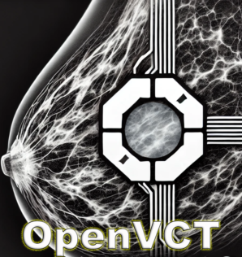

# **OpenVCT** 

  
*Virtual Clinical Trials Platform for Medical Imaging*

---

## **Project Overview**  
The **OpenVCT** project provides a unified platform for conducting **Virtual Clinical Trials (VCTs)** in medical imaging. It includes tools for simulating patient accrual, reader studies, and generating cohorts of patients and medical images. To ensure cross-system compatibility, OpenVCT leverages standard data formats like **DICOM**.

This project is an updated, containerized implementation of the original version hosted on SourceForge ([link here](https://sourceforge.net/projects/openvct/)). We utilize **Docker** as the development platform for our applications.

For more details on the methodology behind OpenVCT, please refer to the following publications:

- [1] Add reference
- [2] Add reference

---

## **Installation**

OpenVCT is containerized for simplicity. Follow the steps below to get started:

```bash
# 1. Install CUDA Toolkit:
https://developer.nvidia.com/cuda-toolkit

# 2. Install Docker Desktop:
https://www.docker.com/

# For Windows, first install WSL:
https://learn.microsoft.com/en-us/windows/wsl/install
```
---

## **System Requirements**

- **NVIDIA GPU** (VRAM > 4GB preferred)
- **CUDA Toolkit** version > 8

---

## **Pipeline Documentation**

### **1. OpenVCT.anatomy**  
This **GPU-accelerated** step creates breast phantoms. You'll need to define the phantom configuration as follows:

```python
# Set up the XML file
xml = gen.XMLWriter(config=breast.BreastConfig.CUP_C, 
                    phantom_name="PhantomC",
                    xml_file = "./xml/PhantomC.xml")

# Generate phantom
subprocess.call(["./BreastPhantomGenerator_docker", "-xml_input", xml.xml_file])
```

### **2. OpenVCT.deform**

This **GPU-accelerated** step deforms (i.e., compresses) the breast phantoms. The deformation can be applied for standard mammographic compression views (CC or ML). Below is an example of how to configure the phantom deformation:

```python
# Set up the XML file for deformation
xml = defo.XMLWriter(config=deform.DeformerConfig.CUPC_CC, 
                     in_phantom = "../anatomy/vctx/PhantomC.vctx",
                     out_phantom = "./vctx/PhantomC.vctx",
                     xml_file = "./xml/PhantomC.xml")

# Run the deformation process
subprocess.call(["xvfb-run", "-s", "-screen 0 800x600x24", "python3", "VolumeDeformer.py", xml.xml_file])
```
### **3. OpenVCT.insert**

This method allows insertion of **lesions** (e.g., calcifications, masses) into breast phantoms using voxel addition or replacement.

```python
# Example lesion insertion
xml = ins.Inserter(in_phantom = "../deform/vctx/PhantomC.vctx",
                   out_phantom = "./vctx/PhantomC.vctx",
                   xml_file = "./xml/PhantomC.xml",
                   num_lesions = 2,
                   size_mm = [(13, 13, 7)],
                   db_dir='db/mass')

# Optional weight parameter
subprocess.call(["python3", "./LesionInserter.py", xml.xml_file, '0.3'])
```

### **4. OpenVCT.raytracing**

Simulate x-ray images using GPU-accelerated raytracing methods. A noise model simulates clinical noise (electronic and quantum) using methods developed by the **LAVI-USP** group (Brazil, https://github.com/LAVI-USP).

```python
# Define ray tracing settings
xml = proj.XMLWriter(config=system.SystemConfig.HOLOGIC, 
                     phantom_name="../inserter/vctx/PhantomC.vctx", 
                     folder_name="proj/PhantomC-proj",
                     xml_file = "./xml/PhantomC.xml")

# Run ray tracing
subprocess.call(["./XPLProjectionSim_GPU_docker", "-xml_input", xml.xml_file])

# Add clinical noise
noise = noise.NoiseModel(config=system.SystemConfig.HOLOGIC, 
                         input_folder="raytracing/proj/phantomC-proj",
                         output_folder="noise/proj/phantomC-proj")
noise.add_noise()
```

---

## **Disclosures**

OpenVCT is an ongoing project with the following limitations:

1) Lack of finer structures simulated in the breast. A simplex-based method has been implemented and will be integrated. [GitHub](https://github.com/jpvt/NoiseVolumesDemo)
2) Compressions are limited to CC and ML views; the pectoralis muscle is not simulated.
3) Scatter is not implemented in the ray tracing approach.

## **Licenses**

## **Contact**

For any inquiries or issues with the project, please reach out to our team's GitHub webpage (issues section):

X-ray Physics Laboratory (XPL) | [GitHub](https://github.com/upenn/xpl/xpl-OPENVCT_PIPELINE)

For other specific questions, contact: 

Bruno Barufaldi – Bruno.Barufaldi@pennmedicine.upenn.edu | [GitHub](https://github.com/bbarufaldi)
Andrew Maidment – Andrew.mMidment@pennmedicine.upenn.edu | [GitHub](https://github.com/maidment)

## **Contributors**

We are very thankful for all contributors to this project:

Marcelo Vieira and LAVI-USP - mvieira@sc.usp.br | [GitHub](https://github.com/LAVI-USP)
Miguel Lago and FDA (VICTRE Project) - miguel.lago@fda.hhs.gov | [GitHub](https://github.com/malago86)

## **Funding Sources**

Terri-Brodeur Breast Cancer Foundation with grant 2023 TBBCF  (PI: Barufaldi)
Susan G. Komen Foundation with grant 2022 CCR231010477 (PI: Barufaldi)